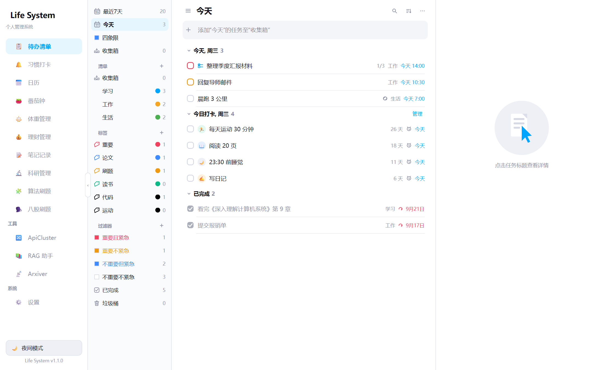
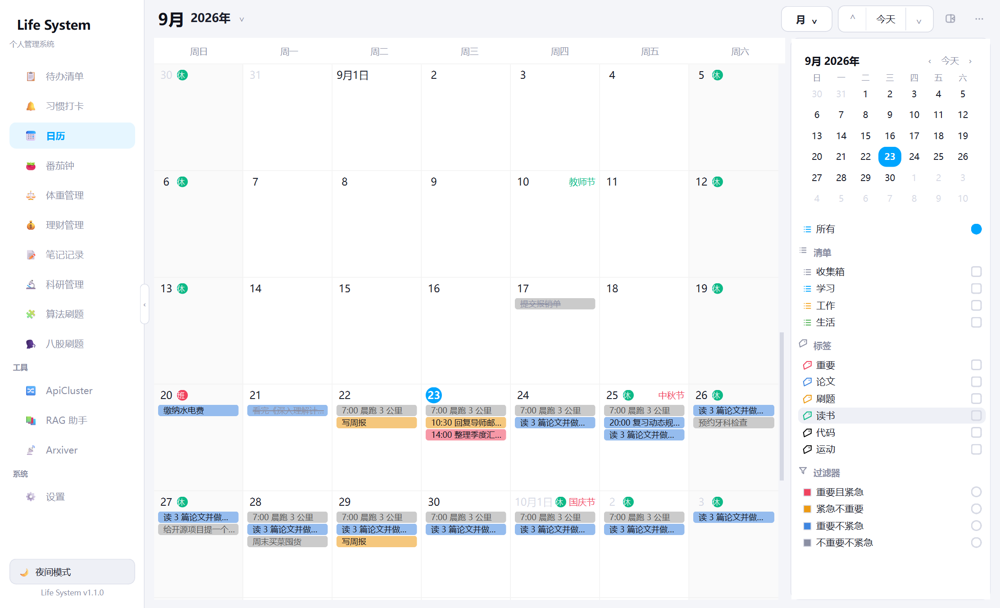
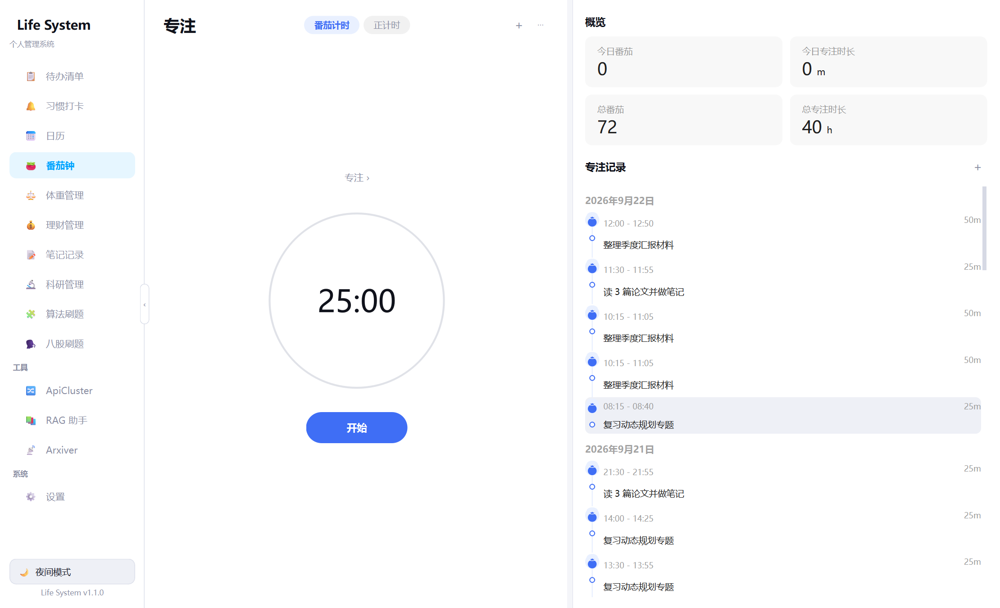
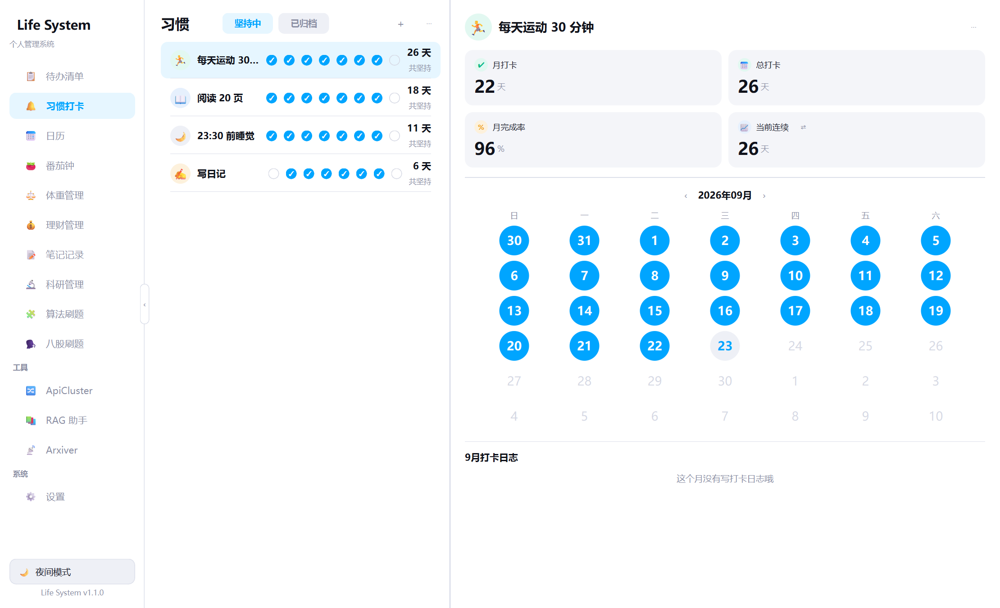

# Life System · 个人管理系统

> 一个 Windows 桌面端的全部生活管理：待办、专注、健康、理财、笔记、科研，十个页面，零后端，数据全在本地一个 SQLite 文件里。

   

## 界面

| 待办清单（三栏 + 内嵌今日打卡） | 日历（时间轴 / 日 / 周 / 月） |
| --- | --- |
|  |  |
| **番茄钟** | **习惯打卡** |
|  |  |

> 以上截图为演示数据，界面运行时的数据全部存放在你自己的 `~/.life_system/life.db`。

市面上的待办软件要么把数据放云上，要么把「专注」「记账」「笔记」拆成五个 App。这个项目是我自己日用的一套：**一个进程、一个 .db、十个页面**，界面按滴答清单的交互习惯重做，图表全部 QPainter 自绘（不引入 matplotlib / pyqtgraph）。

## 模块

| 模块 | 干什么 |
| --- | --- |
| 📋 **待办清单** | 滴答式三栏（智能清单 / 文件夹 / 标签 / 自定义过滤器 / 垃圾桶）、自然语言快速添加（`明天 15:00 #工作 @重要 !高`）、过期一键顺延、拖拽排序、详情即时保存 |
| 📅 **日历** | 与待办同一份数据，五视图 + 重复规则展开 + ICS 订阅 |
| 🍅 **番茄钟 / 专注** | 环形进度、专注-短休-长休轮换、每日目标、近 7 天统计、白噪音与 12 种提示音 |
| ✅ **习惯打卡** | 频次可配，待办页内嵌「今日打卡」，连续天数与达成率 |
| 📊 **统计** | 完成度、专注时长、习惯达成率的自绘图表 |
| ⚖️ **体重** | 记录、折线趋势、BMI 与分类、目标差距 |
| 💰 **理财** | 收支记账、分类柱状图、月度预算与超支预警、周期账单、自定义分类 |
| 📝 **笔记** | **Obsidian 库的只读前端**：自动发现你注册的库，全文搜索命中正文并定位到行，渲染 Markdown / 双链 / 标签 / 本地图片，反向链接带上下文；可把科研进展、专注记录、待快照导出成 md 落到 `<库>/LifeSystem/` |
| 🔬 **科研管理** | 按六步科研路线组织在研课题：投稿目标（会议 + 截稿日 + 作者角色 + 优先级）、自定义 DDL 清单、一键同步成待办；论文库交给 [Arxiver](https://github.com/Umbrellalalala/arxiver) 只读接入 |
| 🧠 **算法刷题 / 面试** | 只存你自己录入的题目与解法，复习排期落成待办 |
| 🗒 **便签** | 独立顶层小窗，内容直接写进待办表 |
| 🔧 **集成工具** | 在同一侧边栏里拉起 [ApiCluster](https://github.com/Umbrellalalala/api-cluster) / [RAG 文件助手](https://github.com/Umbrellalalala/rag) / Arxiver |

## 快速开始

```bash
pip install -r requirements.txt   # PySide6 + markdown，就两个依赖
python run.py
```

打包成单文件 exe：

```bash
pip install pyinstaller
build.bat                         # 产物 dist/LifeSystem.exe
```

> 建议 Python 3.10+。GUI 需要系统 Python 环境，PySide6 装好即可。

## 数据存储

```
~/.life_system/life.db        # 待办 / 专注 / 体重 / 记账 / 科研，结构化数据全在这
~/.life_system/sounds/        # 首次播放时生成的白噪音
~/.life_system/backups/       # 自动备份
```

- 数据目录与 exe / 源码位置解耦：换电脑拷走 `life.db` 即可，卸载程序不会删它。
- **笔记不在这里**，它就在你自己的 Obsidian 库里，本应用只读、不另存副本。
- 侧边栏「导出数据」一键导出全部表为 JSON + CSV。

## 主题

日间模式为默认，左下角一键切夜间，切换是 RGB 插值动画（约 0.34s），偏好自动记忆。

## 项目结构

```
life_system/
├── run.py                    # 入口
├── lifeapp/
│   ├── main.py               # 应用启动
│   ├── main_window.py        # 主窗口 + 侧边导航
│   ├── config.py             # 路径与配置
│   ├── db.py                 # 建表与一次性迁移
│   ├── services.py           # 数据访问层
│   ├── vault.py              # Obsidian 发现 / 全文搜索 / 跳转 / 导出 md
│   ├── theme.py              # 双主题 QSS（强调色 #00a5ff）
│   ├── popups.py             # 全应用统一的弹层组件
│   ├── widgets.py            # 卡片 / 图表 / 标签
│   ├── focus_ui.py           # 番茄钟自绘界面
│   ├── sounds.py             # 提示音与白噪音引擎
│   └── pages/                # 十个页面，calendar/ 是子包
└── assets/                   # 图标与 12 个提示音 wav
```

## 说明

- 集成工具页依赖上面提到的三个外部项目，没装的话点开会提示目录不存在，其余功能不受影响。
- 本仓库不含任何编译产物与个人数据。

## License

[MIT](LICENSE)

---

如果这个项目对你有用，**给个 Star 就是最好的支持** ⭐ 有问题或建议开 [Issue](https://github.com/Umbrellalalala/life-system/issues)。

同系列：[ApiCluster](https://github.com/Umbrellalalala/api-cluster)（本地聚合各家大模型 API）· [Arxiver](https://github.com/Umbrellalalala/arxiver)（顶会论文追踪）· [RAG 文件助手](https://github.com/Umbrellalalala/rag)（本地文档问答）
